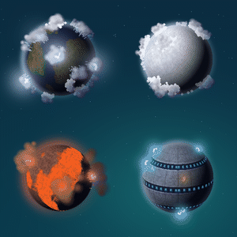

# Atmosphere Weather

Realistic, living weather for every planet in **Planetary Annihilation: Titans**.

Clouds form, grow, drift with the wind, rain or snow and fade away. Storms bring
lightning. Lava planets erupt with ash plumes, and metal planets crackle with
electric sparks. Every planet gets weather that fits its biome.

- **Cosmetic and client-side only.** It does not change gameplay, and other
  players do not need it.
- Works in any match, on any system, with any number of planets.
- Adjustable in **Settings > Atmosphere Weather**.

Authors: Pablo & Claude.

## What you will see

The weather is simulated, not random: rain only falls from a cloud that got
saturated, and a storm only grows from heavy rain.

| Planet | Weather |
|---|---|
| **Earth** | Clouds and rain across the planet, thunderstorms, snow near the poles. |
| **Tropical** | Dense, frequent clouds, heavy rain and more thunderstorms. Never snows. |
| **Desert** | Rare, scattered clouds. Rain often dries up before landing (virga). Rare but strong storms. |
| **Ice** | Snow everywhere, few storms. |
| **Lava** | Volcanic ash plumes with lightning inside, falling ash and acid rain. |
| **Metal** | Electric sparks jumping over the plates and trenches. |
| Moon, asteroid, gas giant, sun | No weather (no atmosphere). |

- **Wind by latitude**: clouds move with realistic wind bands, and rain and
  snow lean with the wind.
- **Day and night**: clouds are lit by the sun and darken on the night side.
- **Lightning**: strikes to the ground and flashes inside the clouds.

## Settings

Open **Settings > Atmosphere Weather**. Changes apply during the match; options
marked with * take effect in your next match.

### Detail

- **Weather detail (all effects)**: Match game graphics, Low, Medium, High
  (default), Extreme, or Custom. Lower detail shows fewer effects and runs
  better on slower computers. *Match game graphics* follows your Graphics
  quality preset. Extreme shows 50% more than High; if the game stutters,
  lower the detail.

### Turn effects on or off

Clouds, rain, snow, rain that dries up before landing, lightning in storms*,
volcano ash clouds*, lightning in volcano ash*, and electric sparks on metal
planets. Turning an effect off does not remove it at once: what is already in
the sky fades out on its own (up to 2 minutes).

### Detail per effect

Set Low / Medium / High / Extreme separately for clouds, rain and snow, storm
lightning*, volcano ash clouds*, volcano lightning* and metal sparks*.
Changing one sets the general detail to *Custom*.

### Advanced (hidden until you turn on "Show advanced options")

- **Weather behavior**: how fast clouds drift, how often clouds turn into rain,
  how often rain turns into a storm, how long rain lasts, how long clouds last.
- **Performance**: effect limit per planet, effect limit for the whole system,
  how fast new clouds and rain appear, seconds between cloud movement updates.
  Higher values can make the game stutter.
- **Troubleshooting**: write troubleshooting info to the game log (off by
  default).

If something breaks after changing advanced options, press **Restore tab
defaults** in the settings menu.

## Languages

The settings menu is translated into every language of the game. Translations
were made with AI; languages not yet reviewed by a native speaker show a short
notice at the top of the tab and may contain errors. Reviewed so far: Spanish.
Please report translation errors in
[Discussions](https://github.com/pablohenriquez93k-glitch/atmosphere-weather/discussions).

## Performance

Tested on large systems (12 planets, 6 with weather) with steady frame times at
High and Extreme. If you notice stutter, lower **Weather detail** or turn off
the effects you do not need.

## Install

Install from **Community Mods** (search "Atmosphere Weather") and enable it.
Requires PA: Titans.

## Feedback and bug reports

Use [GitHub Discussions](https://github.com/pablohenriquez93k-glitch/atmosphere-weather/discussions).
For a bug report, turn on *Advanced > Troubleshooting > Yes*, play until it
happens, and attach the lines with `[AtmosphereWeather` from your game log
(`%LOCALAPPDATA%\Uber Entertainment\Planetary Annihilation\log\`).
